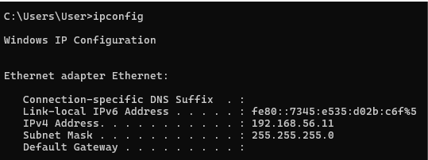
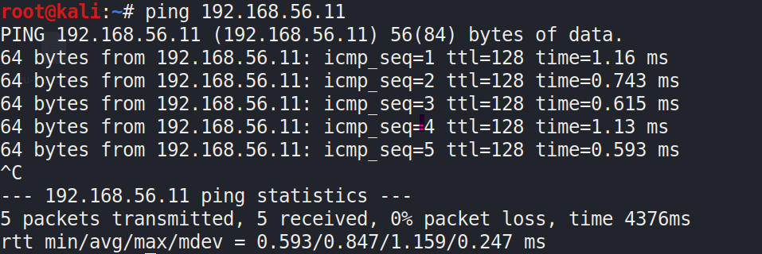
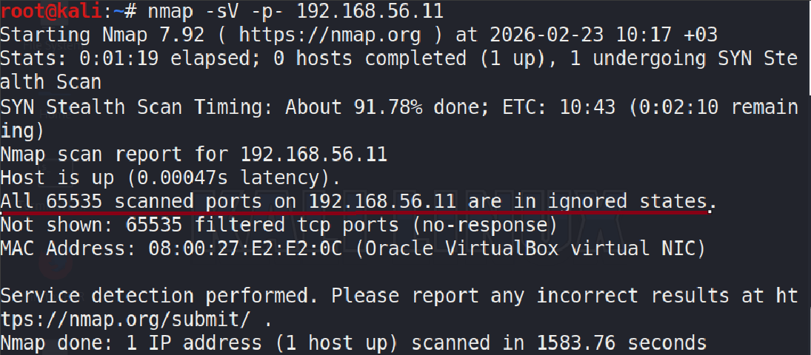
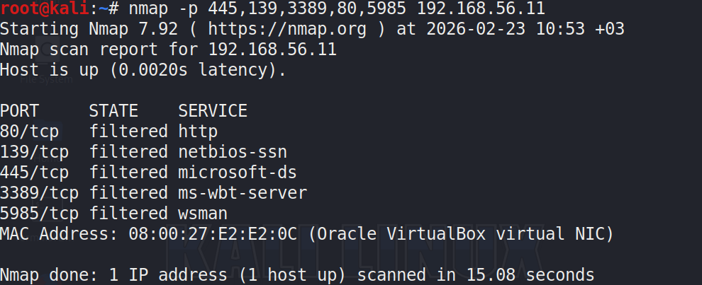

# Phase 1 – SMB 445 Filtered File Retrieval Test

## Objective
This phase tests whether a file can be retrieved from a Windows host when SMB (TCP 445) is filtered by firewall rules.

The goal is to evaluate if network-level access alone is sufficient for file retrieval.

## Lab Environment

- Attacker Machine: Kali Linux  
- Target Machine: Windows  
- Network: VirtualBox Internal Network  
- Attacker IP: 192.168.56.10  
- Target IP: 192.168.56.11  
- Firewall: Enabled on Windows

- ## 1. Target IP Verification

Windows IP configuration was verified to confirm correct network setup.

## 2. Connectivity Test

The attacker machine successfully pinged the target host.

Observation:
The host is reachable, but service accessibility is unknown.

## 3. Full Port Scan

Command used:

nmap -p- 192.168.56.11

Result:
All 65535 TCP ports were reported as filtered.

Interpretation:
The host is reachable but all inbound connections are blocked by firewall rules.

## 4. Targeted Critical Port Scan

Command used:

nmap -p 445,139,3389,80,5985 192.168.56.11

Result:
All tested ports were filtered.

Ports tested and reasons:

- 445 → SMB file sharing
- 139 → NetBIOS
- 3389 → RDP remote access
- 80 → HTTP web access
- 5985 → WinRM remote management

No accessible services were found.

## 5. Firewall Verification

Windows firewall configuration was checked.

Command:

netsh advfirewall show allprofiles

Result:
Firewall is enabled with inbound traffic blocked.

Policy:
BlockInbound, AllowOutbound

## Conclusion

When SMB (TCP 445) and all alternative service ports are filtered by firewall rules,
direct network-level file retrieval is not possible.

The firewall configuration effectively prevents remote file access.

This concludes Phase 1 of the assessment.

