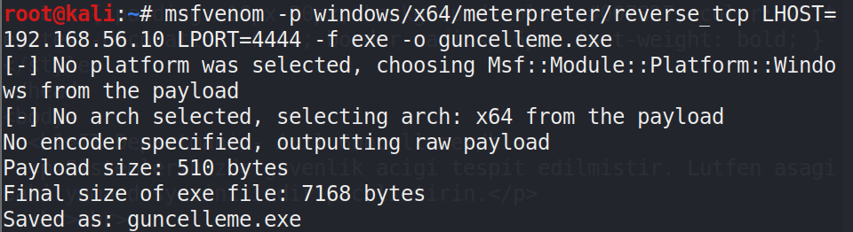
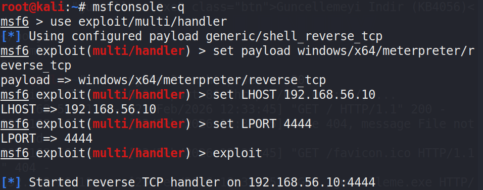
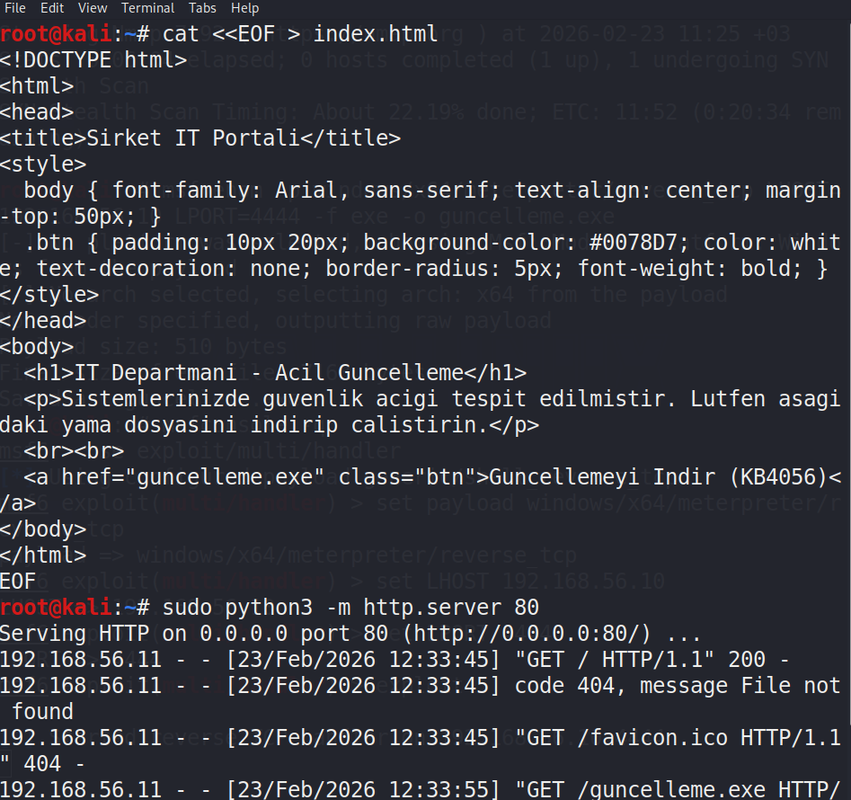
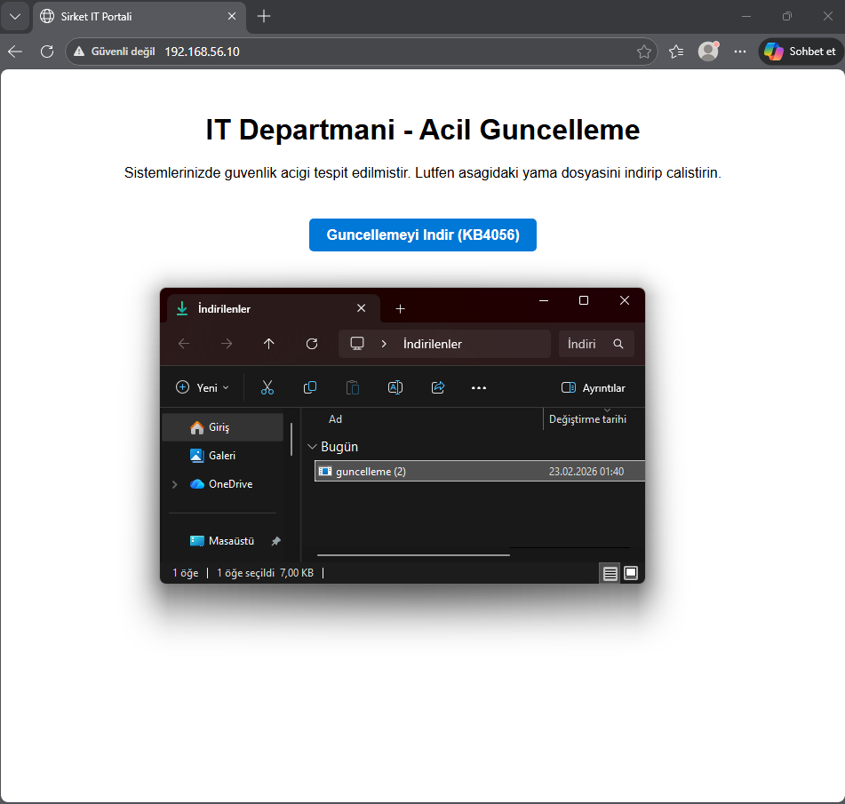
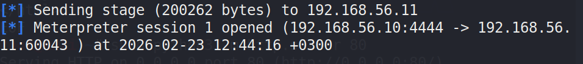
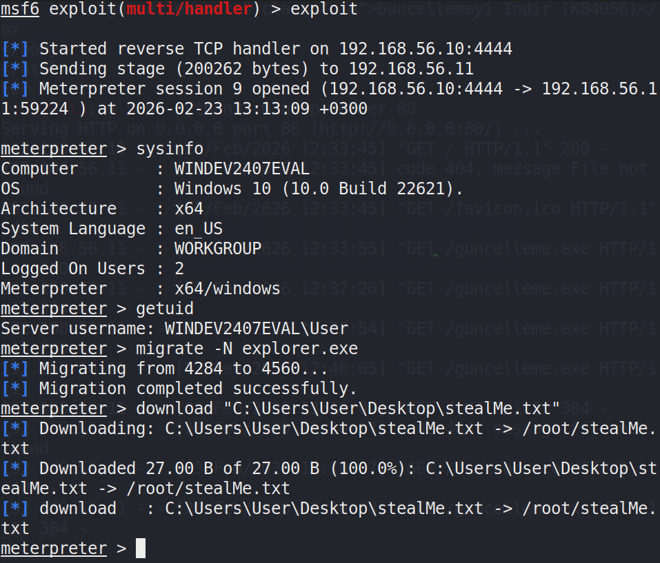
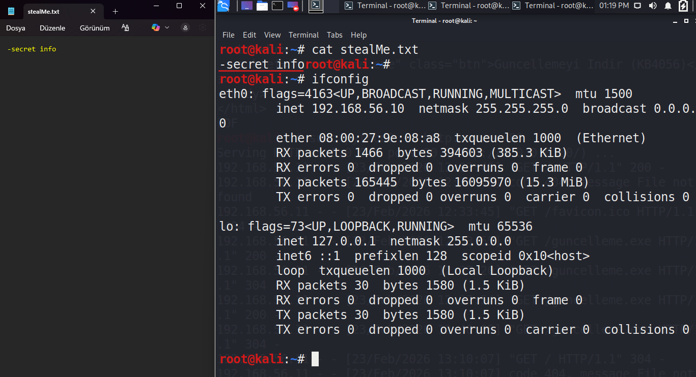

# Phase 2 – Client-Side Attack Simulation & Reverse Connection Validation

> This phase was conducted entirely in an isolated VirtualBox lab environment for internship training purposes.

---

## Objective

Phase 1 demonstrated that inbound services (SMB, RDP, WinRM, etc.) were filtered by the Windows Firewall.

The goal of Phase 2 was to evaluate whether:

**Host-level access and file retrieval are still possible through a client-side attack that establishes an outbound reverse connection, even when inbound ports are blocked.**

---

## Lab Environment

| Role | OS / Hostname | IP Address | Notes |
|------|----------------|------------|------|
| Attacker | Kali Linux | `192.168.56.10` | Metasploit Framework + local HTTP server |
| Victim | Windows 11 (EVAL) | `192.168.56.11` | Windows Firewall enabled, inbound filtered |
| Network | VirtualBox Host-Only | `192.168.56.0/24` | Offline / isolated segment |

---

# Step 1 – Payload Preparation

A Windows executable was generated to establish an outbound reverse connection back to the attacker.

Purpose:
- Bypass inbound firewall filtering
- Force the victim to initiate the connection

Below is the payload generation process:

---

# Step 2 – Reverse Handler Setup

On the attacker machine, a listener/handler was configured to receive the reverse connection once the victim executes the file.

Purpose:
- Prepare Kali to accept incoming reverse session
- Wait for victim callback

Handler configuration:

---

# Step 3 – Phishing Simulation (Delivery Mechanism)

To simulate a realistic enterprise attack scenario:

- A fake internal IT update portal was created.
- A local HTTP server was started on port 80.
- The payload was hosted on this page.

Purpose:
- Simulate social engineering delivery
- Represent user-assisted compromise

Fake portal and HTTP server:

---

# Step 4 – Victim Interaction

On the Windows machine:

- The victim visited http://192.168.56.10
- Downloaded the "update"
- Executed the file manually

This step represents user-assisted execution.

Victim-side interaction:

---

# Step 5 – Reverse Connection Established

After execution:

- The victim system initiated an outbound connection.
- A meterpreter session was successfully opened.
- Host identity and user context were verified.

This confirms host-level access.

Session established:

---

# Step 6 – Defensive Interference Observed

During post-exploitation:

- Windows Defender interfered with session stability.
- Sessions were dropped intermittently.
- Broad search commands triggered defensive mechanisms.
- Process migration was attempted but did not fully stabilize the session.

This reflects real-world endpoint defense behavior.

Instead of prolonged interaction, a rapid approach was required.

---

# Step 7 – Smash-and-Grab File Retrieval

Because:

- The file location was already known (Desktop)
- Session stability was unreliable
- Defender was actively interfering

A rapid file retrieval approach was used.

The file was directly accessed using its known path, minimizing dwell time.

File download operation:

---

# Step 8 – Verification on Attacker Machine

After retrieval:

- The file was verified on Kali.
- File content was displayed.
- Attacker network interface was shown for evidence integrity.

This confirms successful data exfiltration within the lab.

Proof on Kali:

---

# Key Findings

- Inbound firewall rules alone are insufficient.
- Outbound reverse connections bypass inbound filtering.
- User interaction is a critical attack vector.
- Endpoint defenses reduce stability but do not always prevent rapid data retrieval.
- Short-lived sessions can still lead to successful exfiltration.

---

# Conclusion

Even with inbound ports filtered and firewall enabled, a client-side execution scenario allowed:

- Reverse connection establishment  
- Host-level access  
- Rapid file retrieval  

This demonstrates the importance of layered security, including:

- Egress filtering  
- Endpoint detection & response  
- Application control  
- User awareness  

Network firewall protection alone is not enough.
